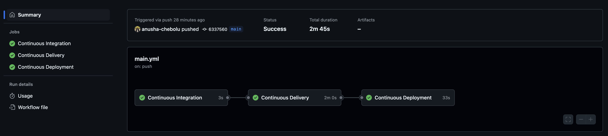
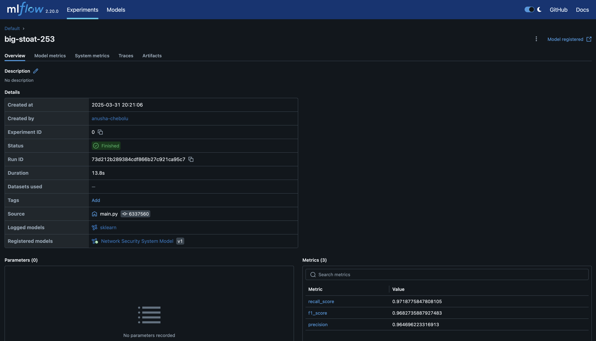
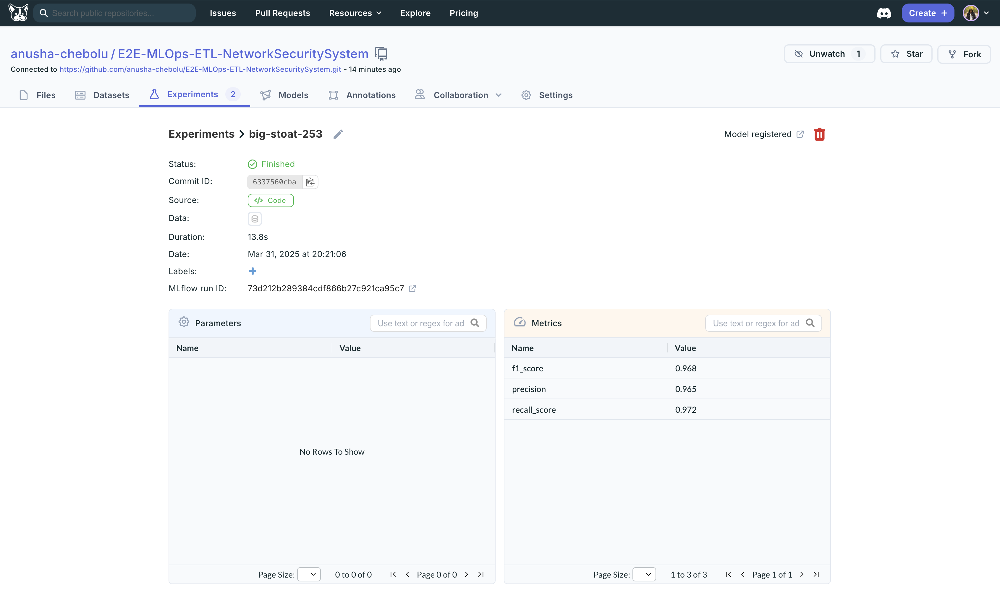
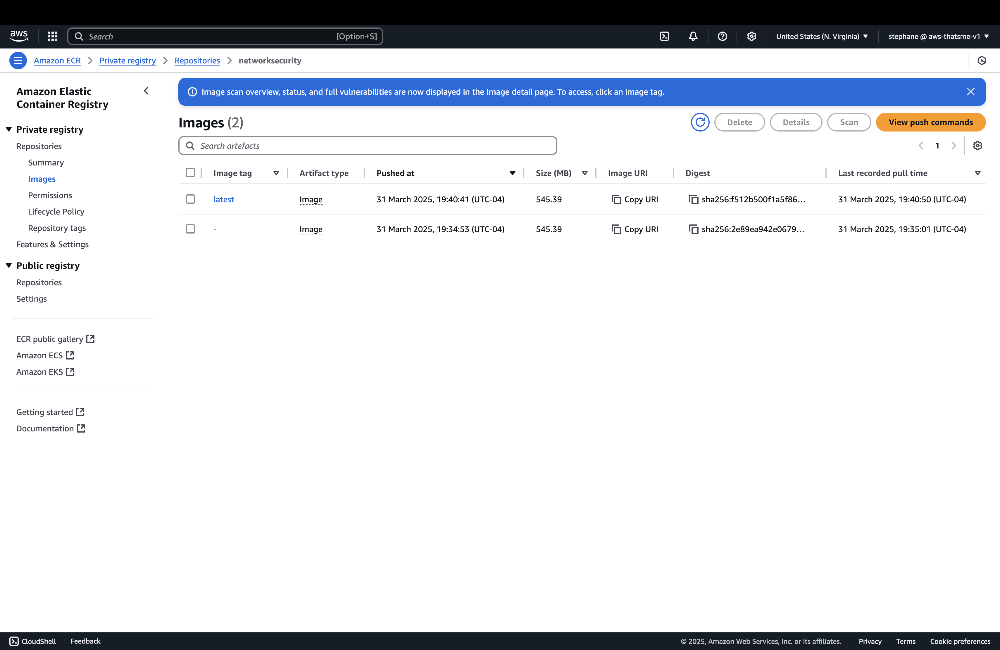
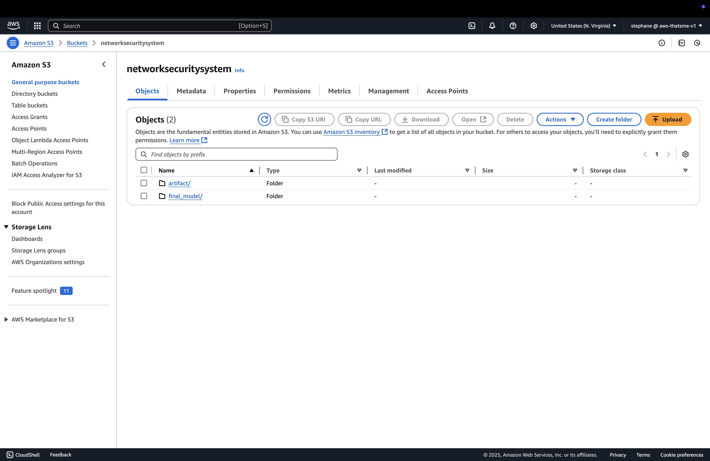

# Network Security System with MLOps Pipeline

A comprehensive end-to-end MLOps project that implements a Network Security System using machine learning for threat detection and analysis. This project demonstrates professional-grade software engineering practices, MLOps principles, and cloud integration.

## 🚀 Features

- **End-to-End MLOps Pipeline**: Complete workflow from data ingestion to model deployment
- **Automated ML Pipeline**: Automated data validation, transformation, and model training
- **Cloud Integration**: Ready for cloud deployment with infrastructure-as-code support
- **MLflow Integration**: Model tracking and experiment management
- **RESTful API**: FastAPI-based API for model inference and training
- **Modular Architecture**: Well-structured, maintainable codebase following best practices

## 🛠️ Technologies Used

- Python 3.x
- FastAPI
- Scikit-learn
- MLflow
- DAGsHub
- AWS
- Docker
- Git

## 📊 Project Dashboard

### CI/CD Pipeline

*Successful deployment pipeline with continuous integration, delivery, and deployment stages*

### Model Performance Tracking

*Model tracking in MLflow showing excellent performance metrics (F1: 0.968, Precision: 0.965, Recall: 0.972)*

### GitHub Integration

*Project repository with MLOps experiment tracking*

### Cloud Deployment

*Docker images stored in Amazon Elastic Container Registry*


*Artifact and model storage in Amazon S3*

## 📁 Project Structure

```bash
networksecurity/
├── cloud/           # Cloud infrastructure and deployment configs
├── components/      # Core ML pipeline components
├── constant/        # Configuration constants
├── entity/         # Data models and entities
├── exception/      # Custom exception handling
├── logging/        # Logging configuration
├── pipeline/       # ETL and ML workflows
└── utils/          # Utility functions and helpers
```

## 🏗️ Architecture

The project follows a modular architecture with clear separation of concerns:

- **Data Ingestion**: Handles data collection and preprocessing
- **Data Validation**: Ensures data quality and consistency
- **Data Transformation**: Feature engineering and data preparation
- **Model Training**: Automated model training with hyperparameter tuning
- **Model Evaluation**: Comprehensive model evaluation metrics
- **API Layer**: RESTful endpoints for model inference

## 🚀 Getting Started

### Local Setup

1. Clone the repository:
```bash
git clone https://github.com/yourusername/NetworkSecuritySystem.git
cd NetworkSecuritySystem
```

2. Install dependencies:
```bash
pip install -r requirements.txt
```

3. Set up environment variables:
```bash
cp .env.example .env
# Edit .env with your configuration
```

4. Run the application:
```bash
uvicorn app:app --reload
```

### AWS EC2 Deployment

1. Connect to your EC2 instance using SSH

2. Update the system packages:
```bash
sudo apt-get update -y
sudo apt-get upgrade -y
```

3. Install Docker:
```bash
curl -fsSL https://get.docker.com -o get-docker.sh
sudo sh get-docker.sh
```

4. Add your user to the Docker group:
```bash
sudo usermod -aG docker ubuntu
newgrp docker
```

5. Clone and set up the project:
```bash
git clone https://github.com/yourusername/NetworkSecuritySystem.git
cd NetworkSecuritySystem
```

6. Build and run with Docker:
```bash
docker build -t networksecurity .
docker run -d -p 8000:8000 networksecurity
```

## 📊 API Endpoints

- `GET /`: Health check endpoint
- `POST /train`: Trigger model training pipeline
- `POST /predict`: Get predictions from the trained model

## 📈 Model Performance

Our model achieves excellent performance metrics:
- F1 Score: 0.968
- Precision: 0.965
- Recall: 0.972

## 🔒 Security Features

- Network traffic analysis
- Anomaly detection
- Threat classification
- Real-time monitoring capabilities

## 👤 Author

Anusha Chebolu
- Email: csl.anusha@gmail.com
- LinkedIn: https://www.linkedin.com/in/chebolu-anusha/